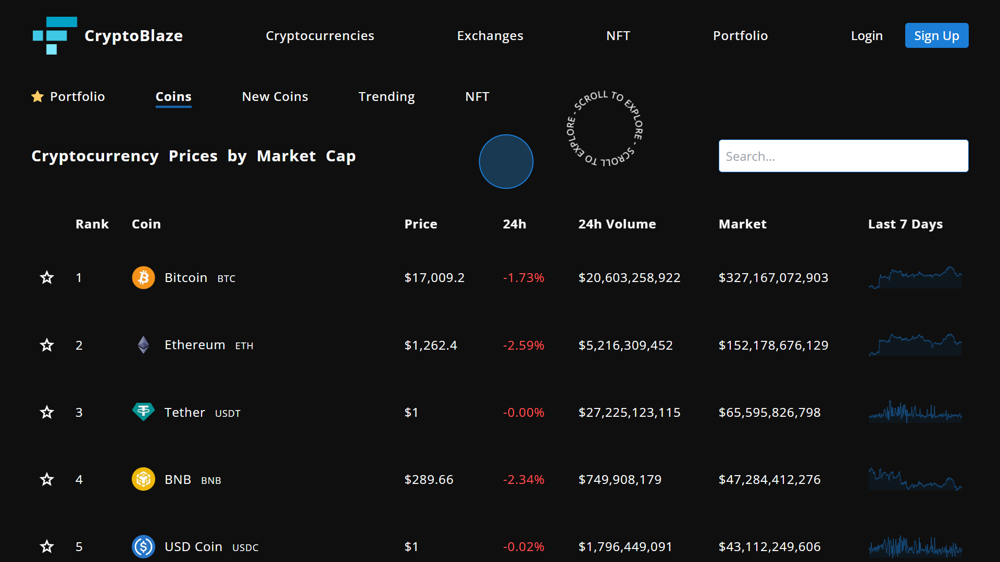

# CrptoBlaze.

a web application keeping you informed about the prices of cryptocurrencies with a portfolio to track your favorite coins. Built with ReactJS, NextJS, Typescript, Firebase, Redux TK, Framer Motion, TailwindCSS and a few other tools. - [Live Site](https://crypto-blaze-pearl.vercel.app/)



Local Install

```bash
# Install dependencies
npm install

# Serve with hot reload at localhost:3000
npm run dev
```
